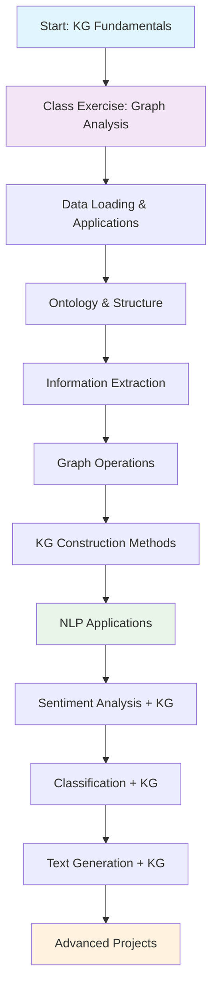

# Knowledge Graphs in Natural Language Processing

## 📚 Course Overview

This directory contains comprehensive educational materials for learning Knowledge Graphs (KGs) and their applications in Natural Language Processing. The curriculum is designed to take students from fundamental graph concepts to advanced NLP applications using Knowledge Graphs.

## 🎯 Learning Objectives

By the end of this module, students will be able to:

1. **Understand Knowledge Graph Fundamentals**
   - Define what Knowledge Graphs are and their components
   - Explain the RDF (Resource Description Framework) model
   - Understand graph theory concepts applied to knowledge representation

2. **Build Knowledge Graphs**
   - Extract structured information from unstructured text
   - Create KGs using different approaches (from scratch, NetworkX, RDF)
   - Design ontologies and schemas for knowledge representation

3. **Analyze Knowledge Graphs**
   - Apply graph algorithms for analysis (centrality, clustering, community detection)
   - Query and traverse knowledge graphs efficiently
   - Visualize knowledge graphs for interpretation

4. **Apply KGs to NLP Tasks**
   - Enhance text classification with knowledge graph features
   - Improve sentiment analysis using structured knowledge
   - Generate text conditioned on knowledge graph information

## 🧠 What are Knowledge Graphs?

### Definition
A **Knowledge Graph** is a structured representation of knowledge that captures entities, their attributes, and the relationships between them in a graph format. It consists of:

- **Entities**: Real-world objects, concepts, or things (e.g., "Barack Obama", "United States")
- **Relations**: Connections between entities (e.g., "born_in", "president_of")
- **Attributes**: Properties of entities (e.g., "age", "population")

### Knowledge Graph Structure
```
Subject --[Predicate]--> Object
   |                        |
Entity                   Entity/Literal

Example:
Barack Obama --[born_in]--> Honolulu
Barack Obama --[spouse_of]--> Michelle Obama
Honolulu --[located_in]--> Hawaii
```

### Why Knowledge Graphs Matter in NLP
- **Structured Knowledge**: Convert unstructured text into structured, queryable format
- **Context Enhancement**: Provide additional context for NLP models
- **Reasoning**: Enable logical inference and knowledge discovery
- **Integration**: Combine information from multiple sources
- **Explainability**: Make AI decisions more interpretable

## 📁 Directory Structure

```
16-KG/
├── Class Ex/
│   ├── Class_Ex_KG.py          # Student exercise file
│   └── Class_Ex_KG_sol.py      # Solution file
├── Lecture Code/
│   ├── 00-fetch_yelp_dataset.py
│   ├── 01-kg_applications.py
│   ├── 02-data_collection_ontology.py
│   ├── 03-triplet_extraction_demo.py
│   ├── 04-networkx_demos.py
│   ├── 05-building_KG_scratch.py
│   ├── 06-building_KG_NetworkX.py
│   ├── 07-sentiment_analysis_kg.py
│   ├── 08-classification_KG.py
│   ├── 09-text_generation_KG.py
│   └── classification_kg_graph.html
└── README.md (this file)
```

## 🎓 Class Exercise

### Class_Ex_KG.py & Class_Ex_KG_sol.py
**Purpose**: Hands-on practice with fundamental graph analysis concepts

**Topics Covered**:
- Loading and exploring the famous Karate Club graph
- Computing centrality measures (degree centrality)
- Finding shortest paths between nodes
- Calculating clustering coefficients
- Community detection using greedy modularity
- Graph visualization

**Key Concepts**:
- **Degree Centrality**: Measures how connected a node is
- **Clustering Coefficient**: Measures how much nodes cluster together
- **Community Detection**: Finding groups of closely connected nodes
- **Shortest Path**: Finding the most efficient route between nodes

**Learning Flow**:
```
Load Graph → Analyze Structure → Compute Metrics → Detect Communities → Visualize
```

## 📖 Lecture Code Breakdown

### 1. Data Foundation (00-01)

#### 00-fetch_yelp_dataset.py
**Purpose**: Data preparation for KG applications
- Loads Yelp Polarity dataset for sentiment analysis experiments
- Demonstrates data loading patterns for NLP-KG integration
- Sets up the foundation for later classification tasks

#### 01-kg_applications.py
**Purpose**: Introduction to KG applications and tools
- **WordNet Integration**: Semantic relationships and synonyms
- **PageRank Algorithm**: Ranking entities in a graph
- **Information Extraction**: Subject-Predicate-Object (SPO) triplet extraction
- **RDF Creation**: Building semantic web compatible knowledge graphs

**Key Technologies**:
- NLTK WordNet for semantic relationships
- NetworkX for graph algorithms
- spaCy for natural language processing
- RDFLib for semantic web standards

### 2. Knowledge Graph Construction (02-06)

#### 02-data_collection_ontology.py
**Purpose**: Building structured KGs from tabular data
- Creates ontology-based knowledge graphs
- Demonstrates RDF class hierarchy
- Shows materialization of triples from structured data
- Exports to Turtle format for interoperability

**Ontology Hierarchy**:
```
Entity (Base Class)
├── Person
└── Company
```

#### 03-triplet_extraction_demo.py
**Purpose**: Extracting structured knowledge from text
- Uses dependency parsing to identify relationships
- Extracts Subject-Predicate-Object triples
- Demonstrates information extraction pipeline
- Handles various sentence structures

**Extraction Process**:
```
Text → Dependency Parse → Identify Relations → Extract Triples → Structure Knowledge
```

#### 04-networkx_demos.py
**Purpose**: Comprehensive graph operations and analysis
- Different graph types (Simple, Directed, MultiGraph)
- Graph traversal algorithms (BFS, DFS)
- Centrality measures (Degree, Betweenness, Closeness)
- Shortest path algorithms
- Interactive visualization with PyVis

**Graph Types Comparison**:
| Type | Edges | Use Case |
|------|-------|----------|
| Simple Graph | Undirected, single | Social networks |
| Directed Graph | Directed, single | Web links, citations |
| MultiGraph | Multiple edges allowed | Transportation networks |

#### 05-building_KG_scratch.py
**Purpose**: Understanding KG data structures fundamentally
- Implements basic triple store from scratch
- Creates indexes for efficient querying
- Demonstrates core KG storage concepts
- Shows manual knowledge graph construction

**Data Structure**:
```python
triples = [(subject, predicate, object), ...]
by_subject = {subject: [triples...]}
by_predicate = {predicate: [triples...]}
by_object = {object: [triples...]}
```

#### 06-building_KG_NetworkX.py
**Purpose**: Advanced KG construction with NetworkX
- Creates complex, real-world knowledge graphs
- Implements labeled edges for relationships
- Advanced visualization techniques
- Demonstrates scalable KG construction

**Example KG Structure**:
```
Barack Obama ──[born_in]──> Honolulu
     │                         │
[spouse_of]              [located_in]
     │                         │
     ▼                         ▼
Michelle Obama            Hawaii
```

### 3. NLP Applications (07-09)

#### 07-sentiment_analysis_kg.py
**Purpose**: Enhancing sentiment analysis with KG features
- Combines traditional TF-IDF with knowledge-based features
- Uses sentiment lexicons as knowledge sources
- Integrates transformer-based sentiment scores
- Compares performance with and without KG enhancement

**Feature Engineering**:
```
Text Features (TF-IDF) + KG Features (Sentiment Lexicon + Transformer Scores) → Enhanced Model
```

**KG Features**:
- Positive word count
- Negative word count
- Sentiment ratio
- Transformer-based sentiment confidence

#### 08-classification_KG.py
**Purpose**: Advanced text classification with KG integration
- Injects KG facts directly into transformer inputs
- Trains DistilBERT with and without KG enhancement
- Visualizes document-fact relationships
- Demonstrates end-to-end KG-enhanced classification

**Architecture**:
```
Text Input → [+ KG Facts] → Tokenization → DistilBERT → Classification
```

**KG Integration Strategy**:
- Extract relevant facts for each document
- Append facts to input text
- Train transformer model on enhanced input
- Compare performance improvements

#### 09-text_generation_KG.py
**Purpose**: Knowledge-aware text generation
- Implements GPT-2 based generation with KG conditioning
- Injects relevant facts into generation context
- Supports fine-tuning with knowledge-enhanced data
- Demonstrates controllable text generation

**Generation Process**:
```
Prompt + KG Facts → GPT-2 Model → Knowledge-Aware Generated Text
```

## 🔧 Technical Requirements

### Required Libraries
```bash
pip install torch transformers datasets
pip install networkx matplotlib pyvis
pip install spacy nltk rdflib
pip install scikit-learn pandas numpy
pip install scipy

# Download spaCy model
python -m spacy download en_core_web_sm

# Download NLTK data
python -c "import nltk; nltk.download('wordnet')"
```

### Hardware Recommendations
- **CPU**: Multi-core processor for parallel processing
- **RAM**: 8GB+ for handling large datasets
- **GPU**: CUDA-compatible GPU for transformer training (optional but recommended)
- **Storage**: 5GB+ for datasets and models

## 🚀 Getting Started

### 1. Environment Setup
```bash
# Clone or navigate to the repository
cd 16-KG

# Install dependencies
pip install -r requirements.txt  # if available, or install manually

# Download required models
python -m spacy download en_core_web_sm
```

### 2. Run Class Exercise
```bash
# Start with the class exercise
python "Class Ex/Class_Ex_KG.py"

# Check your work against the solution
python "Class Ex/Class_Ex_KG_sol.py"
```

### 3. Follow Lecture Sequence
```bash
# Follow the numbered sequence
python "Lecture Code/00-fetch_yelp_dataset.py"
python "Lecture Code/01-kg_applications.py"
# ... continue through 09
```

## 📊 Learning Path Diagram



## 🎯 Key Concepts Summary

### Graph Theory Fundamentals
- **Nodes/Vertices**: Entities in the graph
- **Edges**: Relationships between entities
- **Directed vs Undirected**: Whether relationships have direction
- **Weighted Graphs**: Edges with associated weights/strengths

### Knowledge Representation
- **RDF Triples**: Subject-Predicate-Object statements
- **Ontologies**: Formal specifications of domain knowledge
- **Semantic Web**: Web of linked data
- **SPARQL**: Query language for RDF data

### Graph Algorithms
- **Centrality Measures**: Identifying important nodes
- **Community Detection**: Finding clusters of related entities
- **Path Finding**: Discovering connections between entities
- **Graph Traversal**: Systematic exploration of graph structure

### NLP Integration
- **Feature Enhancement**: Adding KG-derived features to models
- **Context Injection**: Incorporating background knowledge
- **Knowledge-Aware Generation**: Conditioning text generation on facts
- **Structured Prediction**: Using graph structure for predictions

## 🔍 Advanced Topics for Further Study

### 1. Graph Neural Networks (GNNs)
- Graph Convolutional Networks (GCNs)
- Graph Attention Networks (GATs)
- Message Passing Neural Networks

### 2. Knowledge Graph Embeddings
- TransE, TransR, TransH models
- ComplEx, DistMult embeddings
- Neural link prediction

### 3. Large-Scale Knowledge Graphs
- Freebase, Wikidata, Google Knowledge Graph
- Knowledge graph completion
- Entity linking and resolution

### 4. Reasoning and Inference
- Logical reasoning over KGs
- Rule mining and induction
- Probabilistic knowledge graphs

## 📚 Recommended Reading

### Books
1. "Knowledge Graphs: Fundamentals, Techniques, and Applications" by Mayank Kejriwal
2. "Graph Representation Learning" by William L. Hamilton
3. "Networks, Crowds, and Markets" by David Easley and Jon Kleinberg

### Papers
1. "Knowledge Graphs" by Aidan Hogan et al. (2021)
2. "A Survey on Knowledge Graphs: Representation, Acquisition and Applications" by Shaoxiong Ji et al.
3. "Graph Neural Networks: A Review of Methods and Applications" by Jie Zhou et al.

### Online Resources
- Stanford CS224W: Machine Learning with Graphs
- Neo4j Graph Academy
- RDF 1.1 Primer (W3C)

## 🤝 Contributing

Students are encouraged to:
- Experiment with different datasets
- Implement additional graph algorithms
- Create visualizations for better understanding
- Extend the examples with new NLP applications

## 📞 Support

For questions about the code or concepts:
1. Review the comments in each script
2. Check the solution files for reference implementations
3. Consult the recommended reading materials
4. Experiment with smaller examples to build understanding

---

**Happy Learning! 🎓**

*Remember: Knowledge Graphs are not just about storing data—they're about representing knowledge in a way that enables reasoning, discovery, and intelligent applications.*